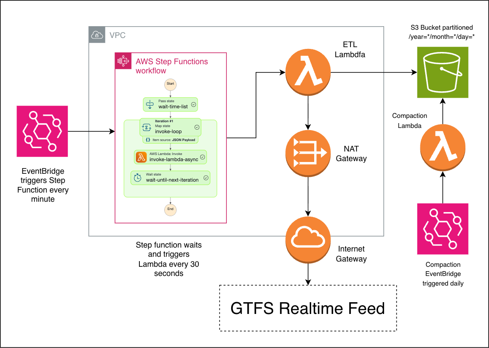

##  GTFS-REALTIME-ETL

Infrastructure as Code (IAC) to ingest [GTFS Realtime](https://gtfs.org/documentation/realtime/reference/#message-vehicleposition) vehicle position data into PostGIS database. 

